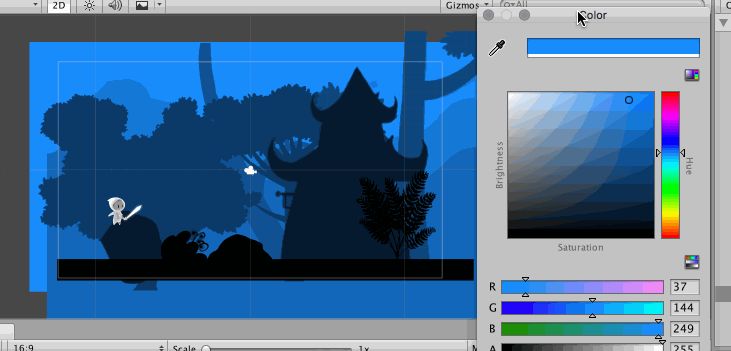

# Unity 2D color fog

This is a small package that adds the color based fog for the Unity's Sprite Renderer component.

#### Usage 
To use this just add the `SpriteFog` material to your `SpriteRenderer` component and add the component `SpriteFog` to your gameObject.

Now just pick the base color and the fog color, you can also add the component `GlobalSpriteFogColor` in any gameObject of the scene to use a global color to the fog.

The `Distance` field controls how much affected by the fog this sprite is.

#### Example
We created a small scene where the fog color is changed from day to night and some rain start to fall down

